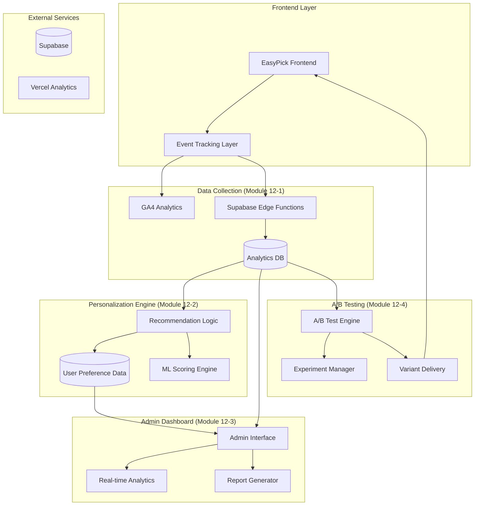
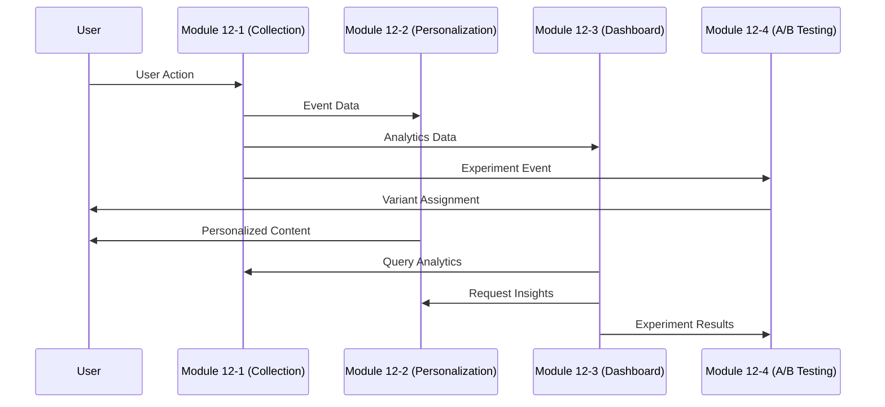

# 📊 Step 12: 사용자 데이터 활용 & 분석 고도화 - 시스템 아키텍처

**작업 목적**: EasyPick 플랫폼의 사용자 데이터 활용을 4개 독립 모듈로 체계화하여 개인화 서비스와 데이터 기반 의사결정을 강화

**설계 원칙**: 모듈별 독립 배포, Progressive Enhancement, Enterprise-Grade Architecture

---

## 🏗️ 전체 시스템 아키텍처

### System Overview



### Core Technology Stack

| Layer | Technology | Purpose |
|-------|------------|---------|
| **Frontend** | React 18 + TypeScript | User interaction tracking |
| **Event Collection** | GA4 + Supabase Edge Functions | Dual-channel analytics |
| **Database** | PostgreSQL + JSONB | High-performance event storage |
| **ML/AI** | Edge Functions + External API | Personalization scoring |
| **Real-time** | WebSocket + Server-Sent Events | Live dashboard updates |
| **A/B Testing** | Custom Engine + Feature Flags | Experiment management |

---

## 📋 Module Specifications

### 🔍 Module 12-1: 사용자 행동로그 수집 (GA4 + Supabase Events)

**목적**: 현재 analytics 시스템을 확장하여 개인화와 A/B 테스트에 필요한 세분화된 사용자 행동 데이터 수집

#### Enhanced Event Schema
```typescript
interface EnhancedEvent extends StandardEvent {
  // 기존 이벤트 + 개인화 데이터
  user_context: {
    session_depth: number        // 세션 내 페이지 깊이
    time_on_page: number        // 페이지 체류 시간
    scroll_depth: number        // 스크롤 깊이 (%)
    interaction_sequence: string[] // 상호작용 순서
    device_capabilities: DeviceInfo
  }
  
  // A/B 테스트 컨텍스트
  experiment_context?: {
    active_experiments: string[]
    variant_assignments: Record<string, string>
    conversion_funnel_step: number
  }
  
  // 개인화 피드백
  personalization_context?: {
    recommendation_shown: string[]
    recommendation_clicked?: string
    user_preference_signals: PreferenceSignal[]
  }
}
```

#### Data Flow Architecture
1. **Event Capture**: Enhanced tracking library (`src/lib/analytics.ts`)
2. **Dual Processing**: GA4 (aggregated) + Supabase (detailed)
3. **Real-time Pipeline**: Edge Function → Analytics DB
4. **Batch Processing**: Daily aggregation for ML training

#### Performance Targets
- Event processing: <100ms P95
- Real-time ingestion: 10K events/min
- Data retention: Raw events (2년), Aggregated (5년)

---

### 🎯 Module 12-2: 개인화 추천 로직

**목적**: 프롬프트 선택과 AI 도구 카드 선택 패턴 기반 개인화 추천 시스템

#### ML-Driven Recommendation Engine

```typescript
interface RecommendationEngine {
  // 사용자 프로파일 기반 추천
  getUserRecommendations(userId: string): Promise<{
    prompts: RecommendedPrompt[]
    tools: RecommendedTool[]
    workflows: RecommendedWorkflow[]
    confidence_scores: Record<string, number>
  }>
  
  // 실시간 컨텍스트 기반 추천
  getContextualRecommendations(context: {
    current_page: string
    recent_interactions: UserAction[]
    session_intent: 'exploration' | 'task_completion' | 'learning'
  }): Promise<ContextualRecommendation[]>
}
```

#### Recommendation Algorithms

1. **Collaborative Filtering**: 유사 사용자 패턴 분석
2. **Content-Based**: 프롬프트/도구 특성 매칭
3. **Hybrid Approach**: 두 방식 조합 + 가중치 최적화
4. **Cold Start Solution**: 신규 사용자용 온보딩 추천

#### Implementation Architecture
```
User Activity → Feature Extraction → ML Model → Recommendation API → Frontend
     ↓              ↓                   ↓             ↓            ↓
Analytics DB → Preference Vector → Edge Function → Cache → UI Components
```

#### Success Metrics
- Click-through Rate: +25%
- User Engagement: +40% session duration
- Conversion Rate: +15% Free→Pro

---

### 📊 Module 12-3: 관리자용 대시보드

**목적**: 실시간 분석, 사용자 인사이트, 비즈니스 메트릭을 통합한 관리자 대시보드

#### Dashboard Architecture

```typescript
interface AdminDashboard {
  // 실시간 메트릭스
  realtime: {
    active_users: number
    current_sessions: SessionMetric[]
    live_events: EventStream
    system_health: HealthStatus
  }
  
  // 비즈니스 인텔리전스
  business_intelligence: {
    user_acquisition: AcquisitionMetrics
    conversion_funnel: FunnelAnalysis
    revenue_analytics: RevenueBreakdown
    feature_usage: FeatureMetrics
  }
  
  // 사용자 인사이트
  user_insights: {
    user_segments: UserSegment[]
    behavioral_patterns: BehaviorPattern[]
    satisfaction_scores: SatisfactionMetrics
    support_analytics: SupportInsights
  }
}
```

#### Dashboard Components

1. **Executive Summary**: KPI 요약 및 트렌드
2. **User Analytics**: 사용자 행동 분석 및 세분화
3. **Feature Performance**: 기능별 사용률 및 만족도
4. **Revenue Dashboard**: 구독 및 결제 분석
5. **System Monitoring**: 성능 및 오류 모니터링

#### Real-time Features
- WebSocket 기반 실시간 업데이트
- 이상 상황 자동 알림
- 커스텀 대시보드 구성
- 데이터 내보내기 (CSV, PDF)

---

### 🧪 Module 12-4: A/B 테스트 워크플로우

**목적**: 자동화된 실험 관리, 통계적 유의성 검증, 점진적 롤아웃

#### A/B Testing Framework

```typescript
interface ExperimentFramework {
  // 실험 설정
  createExperiment(config: {
    name: string
    hypothesis: string
    variations: ExperimentVariation[]
    target_metrics: string[]
    sample_size_calculation: SampleSizeConfig
    duration_estimate: number
  }): Promise<Experiment>
  
  // 사용자 배정
  assignUserToVariant(userId: string, experimentId: string): Promise<{
    variant: string
    tracking_data: VariantTrackingData
  }>
  
  // 결과 분석
  analyzeResults(experimentId: string): Promise<{
    statistical_significance: boolean
    confidence_interval: number
    effect_size: number
    recommendation: 'deploy' | 'iterate' | 'abandon'
  }>
}
```

#### Experiment Types Support

1. **UI/UX Tests**: 컴포넌트 변형, 레이아웃 실험
2. **Feature Flags**: 기능 활성화/비활성화
3. **Content Tests**: 카피, 이미지, CTAs
4. **Algorithmic Tests**: 추천 알고리즘 비교
5. **Pricing Tests**: 구독 가격 및 플랜 실험

#### Statistical Engine
- **Power Analysis**: 적정 샘플 사이즈 계산
- **Bayesian Testing**: 실시간 결과 해석
- **Multiple Testing Correction**: False Discovery Rate 제어
- **Sequential Testing**: 조기 종료 결정 지원

---

## 🔄 Module Integration Strategy

### Inter-Module Communication



### Shared Data Models

```typescript
// 공통 사용자 컨텍스트
interface UserContext {
  user_id: string
  session_id: string
  user_segment: string
  subscription_tier: 'free' | 'pro' | 'business'
  onboarding_completed: boolean
  last_activity: Date
  preferences: UserPreferences
}

// 공통 이벤트 메타데이터
interface EventMetadata {
  trace_id: string
  module_source: '12-1' | '12-2' | '12-3' | '12-4'
  processing_pipeline: string[]
  data_quality_score: number
}
```

---

## 🚀 Implementation Roadmap

### Phase 1: Foundation (Week 1-2)
- [ ] Enhanced event collection schema
- [ ] Database migrations and indexes
- [ ] Basic recommendation API endpoints
- [ ] Admin dashboard framework

### Phase 2: Core Features (Week 3-4)
- [ ] ML recommendation engine
- [ ] Real-time dashboard components
- [ ] A/B testing framework
- [ ] Module integration APIs

### Phase 3: Advanced Features (Week 5-6)
- [ ] Advanced analytics views
- [ ] Automated experiment analysis
- [ ] Performance optimization
- [ ] Comprehensive testing

### Phase 4: Production Deployment (Week 7-8)
- [ ] Production deployment
- [ ] Performance monitoring
- [ ] User acceptance testing
- [ ] Documentation completion

---

## 📁 File Structure

```
src/
├── features/
│   ├── analytics-enhanced/         # Module 12-1
│   │   ├── collectors/
│   │   ├── processors/
│   │   └── schemas/
│   ├── personalization/            # Module 12-2
│   │   ├── engines/
│   │   ├── algorithms/
│   │   └── api/
│   ├── admin-dashboard/            # Module 12-3
│   │   ├── components/
│   │   ├── views/
│   │   └── services/
│   └── ab-testing/                 # Module 12-4
│       ├── framework/
│       ├── experiments/
│       └── analytics/
├── lib/
│   ├── analytics-v2.ts            # Enhanced analytics library
│   ├── ml-utils.ts                # ML utilities
│   └── experiment-utils.ts        # A/B testing utilities
└── types/
    ├── analytics.ts
    ├── personalization.ts
    └── experiments.ts

supabase/
├── functions/
│   ├── analytics-processor/
│   ├── recommendation-engine/
│   ├── dashboard-api/
│   └── experiment-manager/
├── migrations/
│   ├── 20240819_analytics_enhancement.sql
│   ├── 20240819_personalization_schema.sql
│   └── 20240819_experiments_schema.sql
└── analytics-v2-schema.sql
```

---

## 🔒 Security & Privacy Considerations

### Data Protection
- **PII Masking**: 개인식별정보 자동 마스킹
- **데이터 최소화**: 필요한 데이터만 수집
- **보존 정책**: 명확한 데이터 보존 및 삭제 정책
- **접근 제어**: Role-based access control

### GDPR/PIPA Compliance
- **투명성**: 데이터 처리 목적 명시
- **동의**: 명시적 사용자 동의 획득
- **삭제권**: 사용자 데이터 완전 삭제 지원
- **이동권**: 데이터 내보내기 기능 제공

---

## 📊 Success Metrics & KPIs

### Module 12-1 (Collection)
- 이벤트 수집 정확도: 99.5%+
- 실시간 처리 지연: <100ms P95
- 데이터 품질 점수: 95%+

### Module 12-2 (Personalization)
- 개인화 추천 CTR: +25%
- 사용자 참여도: +40%
- 전환율 개선: +15%

### Module 12-3 (Dashboard)
- 대시보드 로딩 시간: <2s
- 데이터 정확도: 99%+
- 관리자 효율성: +50%

### Module 12-4 (A/B Testing)
- 실험 설정 시간: <30분
- 통계적 유의성 신뢰도: 95%+
- 자동 분석 정확도: 98%+

---

## 🔧 Technical Specifications

### Performance Requirements
- **API Response Time**: <200ms P95
- **Database Query Performance**: <50ms average
- **Real-time Updates**: <500ms latency
- **Concurrent Users**: 1000+ simultaneous

### Scalability Targets
- **Event Processing**: 100K events/hour
- **Data Storage**: 1TB+ analytics data
- **ML Model Training**: Daily batch processing
- **Dashboard Users**: 50+ concurrent admin users

### Monitoring & Alerting
- **Uptime**: 99.9% availability
- **Error Rate**: <0.1% for critical paths
- **Data Loss**: Zero tolerance policy
- **Performance Degradation**: Auto-scaling triggers

---

**문서 작성**: 2024년 8월 19일  
**설계 담당**: Claude Analytics Architect  
**승인 대기**: EasyPick 기술팀