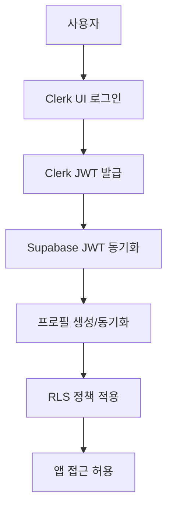

# Clerk + Supabase 인증 통합 가이드

EasyPick AI Tools 플랫폼을 위한 Clerk + Supabase 인증 통합 시스템 구현 가이드입니다.

## 🎯 개요

### 통합 목적
- **Clerk UI**: 세련된 로그인/회원가입 경험 제공
- **Supabase DB**: 사용자 데이터 및 비즈니스 로직 처리
- **RLS 보안**: Row Level Security를 통한 데이터 보호

### 인증 흐름


## 🚀 설치 및 설정

### 1. 의존성 확인
이미 설치된 패키지들:
```json
{
  "@clerk/clerk-react": "^5.42.1",
  "@clerk/clerk-js": "^5.85.0", 
  "@clerk/localizations": "^3.21.2",
  "@supabase/supabase-js": "^2.39.0"
}
```

### 2. 환경 변수 설정
`.env.local`에 추가:
```env
# Clerk 설정
VITE_CLERK_PUBLISHABLE_KEY=pk_test_your_clerk_publishable_key
CLERK_SECRET_KEY=sk_test_your_clerk_secret_key

# Supabase 설정 (기존)
VITE_SUPABASE_URL=https://your-project.supabase.co
VITE_SUPABASE_PUBLISHABLE_KEY=your_supabase_anon_key
```

### 3. Clerk Dashboard 설정

#### JWT Templates 설정
Clerk Dashboard > JWT Templates에서 "supabase" 템플릿 생성:

```json
{
  "aud": "authenticated",
  "exp": "{{exp}}",
  "iat": "{{iat}}",
  "iss": "https://your-clerk-frontend-api.clerk.accounts.dev",
  "sub": "{{user.id}}",
  "email": "{{user.primary_email_address.email_address}}",
  "phone": "{{user.primary_phone_number.phone_number}}",
  "app_metadata": {
    "provider": "clerk",
    "providers": ["clerk"]
  },
  "user_metadata": {
    "email": "{{user.primary_email_address.email_address}}",
    "email_verified": "{{user.primary_email_address.verification.status}}",
    "phone_verified": "{{user.primary_phone_number.verification.status}}",
    "full_name": "{{user.full_name}}",
    "first_name": "{{user.first_name}}",
    "last_name": "{{user.last_name}}",
    "image_url": "{{user.image_url}}"
  },
  "role": "authenticated"
}
```

#### Webhooks 설정 (선택사항)
- Endpoint: `https://your-domain.com/api/clerk/webhooks`
- Events: user.created, user.updated, user.deleted

### 4. Supabase 설정

#### RLS 함수 적용
```sql
-- supabase/migrations/clerk-rls-functions.sql 실행
psql -h your-host -U postgres -d your-database -f supabase/migrations/clerk-rls-functions.sql
```

#### JWT Secret 설정 
Supabase Dashboard > Settings > API > JWT Secret을 Clerk의 JWT Secret으로 업데이트

## 📝 구현된 컴포넌트

### 1. ClerkAuthModal.jsx
```jsx
import ClerkAuthModal from './features/auth/components/ClerkAuthModal.jsx'

// 사용 예제
<ClerkAuthModal 
  open={authModalOpen} 
  onOpenChange={setAuthModalOpen}
  onSuccess={handleAuthSuccess}
  defaultMode="sign-up"
/>
```

**주요 기능**:
- Clerk SignIn/SignUp 컴포넌트 통합
- 자동 Supabase 프로필 동기화
- 한국어 UI 및 에러 메시지
- 로딩 상태 관리

### 2. useClerkAuth Hook
```jsx
import { useClerkAuth } from './services/clerkAuthService.js'

const MyComponent = () => {
  const { 
    user, 
    profile, 
    isAuthenticated, 
    isLoading,
    permissions,
    checkUsageLimit,
    incrementUsage 
  } = useClerkAuth()

  // 사용량 체크 예제
  const handleAction = async () => {
    const canUse = await checkUsageLimit('compile_prompt')
    if (!canUse) {
      toast.error('사용량이 초과되었습니다.')
      return
    }

    // 작업 수행
    await performAction()
    
    // 사용량 기록
    await incrementUsage('compile_prompt', resourceId, { action: 'compile' })
  }

  return (
    <div>
      {isAuthenticated ? (
        <p>환영합니다, {user?.firstName}님!</p>
      ) : (
        <button onClick={() => setAuthModalOpen(true)}>
          로그인
        </button>
      )}
    </div>
  )
}
```

### 3. App 컴포넌트 통합
```jsx
// 기존: src/App.jsx (Supabase Auth)
// 새로운: src/App-with-clerk.jsx (Clerk + Supabase)

import App from './App-with-clerk.jsx' // Clerk 통합 버전 사용
```

## 🔐 인증 흐름 상세

### 1. 로그인 과정
```javascript
// 1. 사용자가 Clerk UI에서 로그인
// 2. Clerk JWT 토큰 발급
const token = await getToken({ template: 'supabase' })

// 3. Supabase에 JWT 설정
await supabaseWithClerk.auth.setSession({
  access_token: token,
  refresh_token: 'clerk-managed'
})

// 4. 사용자 프로필 동기화
const profile = await syncUserProfile(user)

// 5. 권한 정보 업데이트
const permissions = await getUserPermissions(user.id)
```

### 2. RLS 정책 확인
```sql
-- 현재 사용자 ID 확인
SELECT auth.clerk_user_id();

-- 권한 확인
SELECT auth.has_role('pro');
SELECT auth.has_active_subscription();
SELECT auth.can_use_feature('compile_prompt');
```

### 3. API 요청 시 JWT 전달
```javascript
// 자동으로 Clerk JWT가 Authorization 헤더에 포함됨
const { data, error } = await supabaseWithClerk
  .from('clerk_profiles')
  .select('*')
  .eq('id', user.id)
```

## 🛡️ 보안 고려사항

### 1. JWT 검증
- Clerk JWT는 Supabase에서 자동 검증됨
- 만료된 토큰은 자동으로 갱신됨
- 무효한 토큰은 자동으로 세션 종료됨

### 2. RLS 정책
- 기본적으로 모든 접근 거부 (DENY)
- 명시적으로 허용된 작업만 수행 가능
- 사용자는 본인 데이터만 접근 가능
- 관리자는 전체 데이터 접근 가능

### 3. 사용량 제한
```javascript
// 무료 사용자 제한
const freeUsageLimits = {
  compile_prompt: 10,
  run_workflow: 5,
  search_query: 50,
  ai_generation: 3
}

// 유료 사용자는 더 높은 제한
const proUsageLimits = {
  compile_prompt: 1000,
  run_workflow: 500,
  search_query: 5000,
  ai_generation: 100
}
```

## 🔧 사용 방법

### 1. 기본 인증 확인
```jsx
const { isAuthenticated, user } = useClerkAuth()

if (!isAuthenticated) {
  return <LoginPrompt />
}

return <AuthenticatedContent user={user} />
```

### 2. 권한 기반 UI
```jsx
const { permissions } = useClerkAuth()

return (
  <div>
    {permissions.permissions.includes('compile_prompt') ? (
      <PromptComposer />
    ) : (
      <UpgradePrompt feature="프롬프트 생성" />
    )}
  </div>
)
```

### 3. 사용량 제한 확인
```jsx
const handleCompilePrompt = async () => {
  const canUse = await checkUsageLimit('compile_prompt')
  
  if (!canUse) {
    toast.error('프롬프트 생성 한도에 도달했습니다.')
    setUpgradeModalOpen(true)
    return
  }

  // 프롬프트 컴파일 진행
  const result = await compilePrompt(promptData)
  
  // 사용량 기록
  await incrementUsage('compile_prompt', result.id, {
    template_used: promptData.template,
    success: true
  })
}
```

## 🚨 문제 해결

### 1. JWT 동기화 실패
```javascript
// 수동 동기화 재시도
const retrySync = async () => {
  try {
    const token = await getToken({ template: 'supabase' })
    await setSupabaseAuth(token)
    await syncUserProfile(user)
    toast.success('동기화가 완료되었습니다.')
  } catch (error) {
    toast.error('동기화에 실패했습니다. 다시 로그인해주세요.')
  }
}
```

### 2. RLS 정책 오류
```sql
-- 현재 사용자 컨텍스트 확인
SELECT 
  auth.clerk_user_id() as user_id,
  auth.has_role('free') as is_free,
  auth.has_active_subscription() as has_subscription;

-- 특정 테이블 정책 확인
SELECT * FROM pg_policies WHERE tablename = 'clerk_profiles';
```

### 3. 사용량 제한 오류
```javascript
// 사용량 현황 확인
const checkCurrentUsage = async () => {
  const stats = await getUsageStats(user.id, '30 days')
  console.log('현재 사용량:', stats)
}
```

## 📈 모니터링

### 1. 인증 성공률 추적
```javascript
// 인증 이벤트 로깅
const logAuthEvent = async (event, userId, metadata = {}) => {
  await supabase.from('analytics_events').insert({
    user_id: userId,
    event_name: `auth_${event}`,
    event_category: 'authentication',
    properties: metadata
  })
}
```

### 2. 사용량 통계
```sql
-- 일별 사용량 통계
SELECT 
  DATE(created_at) as date,
  event_type,
  COUNT(*) as usage_count,
  COUNT(DISTINCT user_id) as unique_users
FROM clerk_usage_events 
WHERE created_at >= NOW() - INTERVAL '30 days'
GROUP BY DATE(created_at), event_type
ORDER BY date DESC;
```

## 🎉 완료!

이제 Clerk + Supabase 통합 인증 시스템이 준비되었습니다:

1. ✅ **Clerk UI**: 세련된 로그인/회원가입 경험
2. ✅ **Supabase DB**: 안전한 사용자 데이터 관리
3. ✅ **RLS 보안**: 행 수준 보안으로 데이터 보호
4. ✅ **사용량 제한**: 역할 기반 기능 제한
5. ✅ **실시간 동기화**: JWT 토큰 자동 동기화
6. ✅ **한국어 지원**: 완전한 한국어 UI/UX

더 자세한 내용은 각 파일의 주석을 참고하세요!