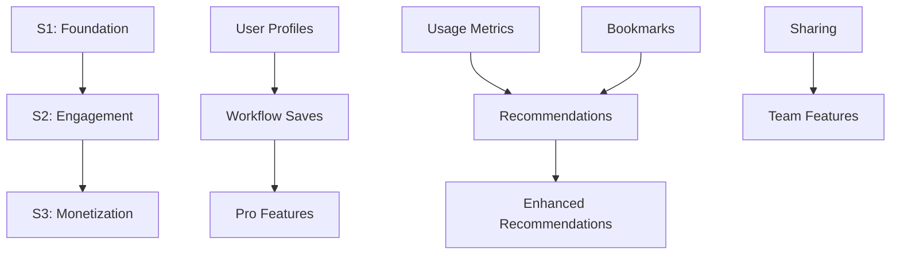

# EasyPick AI Tools - S1→S3 릴리스 플랜

## 📋 개요

EasyPick AI Tools 플랫폼의 단계별 릴리스 계획으로, 한국 사용자 대상 AI 도구 검색 및 워크플로우 실행 서비스의 점진적 기능 확장을 목표로 합니다.

**목표 시장**: 한국 사용자, 모바일 우선 설계  
**기술 스택**: React 18, Vite 6, Tailwind CSS 4, Supabase, Shadcn/ui  
**배포 환경**: GitHub Pages (S1) → Vercel (S2-S3)

**현재 상태**: Step 9 UI 컴포넌트 완료 ✅
- SearchHub.v2 (ARIA Combobox, 키보드 네비게이션)
- ResultGrid.v2 (TanStack Virtual, 3열 레이아웃)
- SideSheet.v2 (반응형 패널, 컴파일 미리보기)
- ActionBar.v2 (고정 액션바, 기능 플래그)
- RunnerTimeline.v2 (진행률 추적, Analytics)

---

## 🚀 Stage 1 (S1): Foundation - 핵심 기능 구축

### 📦 배포 범위
- **허브**: AI 도구 탐색 및 카테고리 필터링
- **프롬프트 엔진**: 프롬프트 생성 및 템플릿 시스템
- **북마크**: 사용자별 AI 도구 저장 기능
- **사용량 계측**: 무료 티어 사용량 추적 및 제한
- **결제 미노출**: Pro 기능 숨김 처리

### 🔧 기술적 의존성
```yaml
Database Schema:
  - users (profiles, preferences)
  - bookmarks (user_id, tool_id, created_at)
  - usage_metrics (user_id, action_type, count, reset_date)
  - ai_tools (static data with categories)

Frontend Components:
  - AppLayout (responsive header/navigation)
  - AIToolIcon (dynamic iconification)
  - BookmarkSystem (save/remove functionality)
  - UsageTracker (limits display)

Analytics Integration:
  - GA4 events: page_view, search, view_item, bookmark_add
  - Korean user behavior tracking
```

### ⚠️ 주요 리스크
| 리스크 | 영향도 | 완화 전략 |
|--------|--------|-----------|
| 모바일 성능 저하 | 높음 | Bundle size <500KB, lazy loading |
| 한국어 입력 오류 | 중간 | 철저한 IME 테스트 |
| 데이터베이스 스키마 변경 | 높음 | 마이그레이션 스크립트 사전 테스트 |
| 사용량 제한 우회 | 중간 | 서버 사이드 검증 |

### ✅ 성공 기준
- 모바일 사용자 만족도 >80%
- 3초 이내 로딩 시간
- 보안 취약점 0개 (High severity)
- 북마크 기능 사용률 >60%

---

## 🔄 Stage 2 (S2): Engagement - 참여도 증대

### 📦 배포 범위
- **러너 저장/공유/재개**: 워크플로우 상태 영속화
- **추천 시스템 1차**: 키워드/태그 기반 매칭
- **회귀 테스트**: S1 기능 무결성 보장

### 🔧 기술적 의존성
```yaml
Extended Schema:
  - saved_workflows (user_id, workflow_data, metadata)
  - workflow_shares (workflow_id, share_token, permissions)
  - user_preferences (recommendation_weights, tags)
  - recommendation_logs (user_id, suggested_tools, interactions)

New Components:
  - WorkflowSaver (serialization/deserialization)
  - ShareModal (URL generation, permissions)
  - RecommendationEngine (keyword matching algorithm)
  - WorkflowResume (state restoration)

Data Dependencies:
  - S1 usage metrics → recommendation training data
  - Bookmark patterns → preference inference
```

### ⚠️ 주요 리스크
| 리스크 | 영향도 | 완화 전략 |
|--------|--------|-----------|
| 워크플로우 직렬화 복잡성 | 높음 | JSON 스키마 검증, 버전 관리 |
| 공유 권한 보안 취약점 | 높음 | Token 기반 인증, 만료 시간 설정 |
| 추천 성능 저하 | 중간 | 인덱싱 최적화, 캐싱 전략 |
| S1 기능 회귀 | 높음 | 자동화된 E2E 테스트 슈트 |

### ✅ 성공 기준
- 워크플로우 저장률 >70%
- 공유 기능 활성화 >30%
- 추천 클릭률 >15%
- S1 기능 성능 저하 <5%

---

## 💰 Stage 3 (S3): Monetization - 수익화 달성

### 📦 배포 범위
- **Pro 과금**: TossPayments 정기결제, Pro 기능 가드
- **팀 보관함**: 협업 워크플로우 공유
- **pgvector 추천**: 임베딩 기반 고도화된 추천
- **데이터 마이그레이션**: S2 → S3 추천 시스템 전환

### 🔧 기술적 의존성
```yaml
Payment Integration:
  - TossPayments SDK (한국 시장 primary)
  - PayPal integration (global backup)
  - subscription_management (billing cycles, renewals)
  - pro_feature_gates (access control middleware)

Team Features:
  - team_repositories (shared workspaces)
  - team_permissions (role-based access)
  - collaboration_logs (activity tracking)

Enhanced Recommendations:
  - pgvector extension (vector similarity)
  - embedding_models (OpenAI/Cohere integration)
  - recommendation_vectors (precomputed embeddings)
  - migration_scripts (S2 keywords → S3 vectors)
```

### ⚠️ 주요 리스크
| 리스크 | 영향도 | 완화 전략 |
|--------|--------|-----------|
| 결제 시스템 규제 준수 | 매우 높음 | 한국 PG사 인증, 법무 검토 |
| 구독 결제 실패 | 높음 | 재시도 로직, 알림 시스템 |
| 데이터 마이그레이션 실패 | 높음 | 단계별 마이그레이션, 롤백 계획 |
| 팀 기능 동기화 이슈 | 중간 | Supabase 실시간 기능 활용 |
| Free → Pro 전환율 저조 | 높음 | A/B 테스트, 가치 제안 최적화 |

### ✅ 성공 기준
- Free → Pro 전환율 >15%
- 결제 실패율 <2%
- 팀 기능 참여도 >40% (Pro 사용자 기준)
- pgvector 추천 클릭률 >25% (S2 대비 증가)

---

## 🔄 배포 전략

### Canary Deployment
```yaml
Stage Rollout:
  1%: 내부 팀 + 베타 사용자
  10%: 활성 사용자 샘플링
  50%: 일반 사용자 확대
  100%: 전체 배포

Feature Flags:
  - S1: enable_bookmarks, enable_usage_tracking
  - S2: enable_workflows, enable_recommendations  
  - S3: enable_payments, enable_teams, enable_pgvector

Monitoring:
  - Real-time error tracking (Sentry)
  - Performance monitoring (Core Web Vitals)
  - Korean mobile device testing
  - Payment gateway health checks
```

### Rollback Procedures
```yaml
Database:
  - Schema versioning with down migrations
  - Data backup before each stage deployment
  - Point-in-time recovery capability

Application:
  - Feature flag instant disable
  - Previous version blue-green deployment
  - CDN cache invalidation

Critical Rollback Triggers:
  - Error rate >1% increase
  - Payment failure rate >5%
  - Mobile performance degradation >20%
  - Security vulnerability detection
```

---

## 📊 KPI 및 모니터링

### 단계별 핵심 지표
```yaml
S1 Metrics:
  - DAU/MAU (Daily/Monthly Active Users)
  - Bookmark creation rate
  - Mobile vs Desktop usage ratio
  - Korean localization accuracy

S2 Metrics:
  - Workflow save completion rate
  - Share link click-through rate
  - Recommendation engagement rate
  - User return rate after saving

S3 Metrics:
  - Free to Pro conversion funnel
  - Monthly Recurring Revenue (MRR)
  - Team feature adoption rate
  - Payment method preferences (Toss vs PayPal)
  - Customer acquisition cost (CAC)
```

### 모바일 우선 성능 목표
- **First Contentful Paint**: <1.5초
- **Largest Contentful Paint**: <2.5초  
- **First Input Delay**: <100ms
- **Cumulative Layout Shift**: <0.1

---

## 🎯 의존성 매트릭스



**Critical Path**: S1 안정성 → S2 사용자 참여 → S3 수익 전환

---

## ⚡ 다음 단계

1. **S1 배포 준비**: 데이터베이스 스키마 최종 검토
2. **테스트 환경 구축**: 한국 모바일 디바이스 테스트 랩
3. **모니터링 설정**: GA4 이벤트 + Supabase Analytics
4. **문서화 완료**: API 문서, 사용자 가이드 (한국어)
5. **베타 사용자 모집**: 한국 AI 관심 사용자 그룹